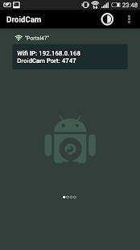
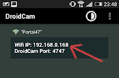

## DroidCam-OpenCV Setup

A simple user guide and python script for setting up your Android phone as a wireless IP camera with OpenCV.

## System Requirements
Python 3

## Phone Setup
1. Go to the **Apps on Google Play** and download [DroidCam](https://play.google.com/store/apps/details?id=com.dev47apps.droidcam&hl=en_SG) on your phone.

2. Once you are done, open the app and the server should start automatically with a specific IP address displayed like so:

## PC Setup
1. Clone this repository.

`git clone https://github.com/cardboardcode/droidcam_simple_setup`

2. Jump to the local directory where you have downloaded the repository.

`cd <path to repo directory>/droidcam_simple_setup`

3. Install the necessary python dependencies. Highly recommend using [`virtualenv`](https://docs.python-guide.org/dev/virtualenvs/).

`pip install -r requirements.txt`

4. Replace the url in `droidcam.py` with the IP address provided on your phone.

eg.
`ip_address=192.168.1.139`

5. Run the script. A brief walk-through of the code in given in its comments.

`python droidcam.py`

## Issues
Has this setup guide helped you or frustrated you? If there are any issues, please post under the **Issues** tab. Any feedback is welcomed.

## Acknowledgement
Code is adapted from OpenCV's [VideoCapture tutorial](https://docs.opencv.org/3.0-beta/doc/py_tutorials/py_gui/py_video_display/py_video_display.html)

For the debian solution, you can find it at [paolorotolo](https://github.com/paolorotolo/droidcam)

Suggestions from [DhruvK's stackoverflow post](https://stackoverflow.com/questions/36102437/streaming-droidcam-video-to-opencv-python-in-anyway-possible) helped as well.

## Tested On:
Ubuntu Xenial 16.04.5
Ubuntu Bionic 18.04.3
